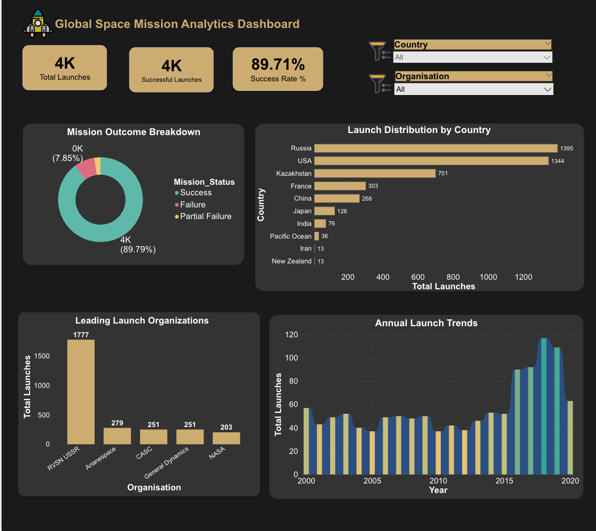

# 🚀 Global Space Mission Analytics Dashboard

## 📊 Project Overview
This project presents an interactive **Power BI dashboard** analyzing global space mission data from **1957 to 2020**. It provides insights into launch trends, mission success rates, and key organizations driving space exploration.

---

## 📷 Dashboard Preview

---

## 🔍 Key Insights
- 🚀 Total Launches: ~4,000 missions
- ✅ Success Rate: **89.71%**
- 🌍 Dominant Countries: Russia and USA
- 📈 Recent Growth: Increase in launches driven by commercial space companies
- 🛰️ Leading Organizations: RVSN USSR, Arianespace, CASC, NASA

According to the dashboard:
- Launch activity peaked during the **space race era**
- Modern years show **renewed growth in space missions**
- High success rate indicates **mature and reliable space technology** :contentReference[oaicite:0]{index=0}

---

## 📌 Features
- 📊 KPI cards (Total launches, success rate)
- 🌍 Country-wise launch distribution
- 📉 Mission outcome breakdown (Success / Failure / Partial)
- 🏢 Organization-wise launch comparison
- 📈 Yearly launch trends
- 🎛️ Interactive filters (Country, Organization)

---

## 🛠️ Tools & Technologies
- Power BI
- Data Cleaning & Transformation
- Data Visualization
- DAX (Data Analysis Expressions)

---

## 📁 Dataset
- Historical space mission dataset (1957–2020)
- Includes launch status, country, organization, and timeline

---

## 🚀 How to Use
1. Download the `.pbix` file
2. Open in Power BI Desktop
3. Interact with filters and visuals

---

## 📌 Project Highlights (For Recruiters)
- Built end-to-end data pipeline (cleaning → modeling → visualization)
- Designed interactive dashboard with real-world insights
- Applied storytelling through data visualization
- Strong focus on usability and decision-making insights

---

## 📈 Future Improvements
- Add real-time data integration
- Include satellite type classification
- Predictive analytics (launch success prediction using ML)

---

## 👤 Author
**Sulagna Dhal**  
📍 Data Analytics | Computer Vision | Machine Learning  

---

## ⭐ If you like this project
Give it a star ⭐ on GitHub!
